# JSONL Viewer — 代码 Wiki

> 面向大文件的 VS Code 扩展：以「记录列表 + 可折叠 JSON 树详情」的方式打开 `.jsonl` / `.ndjson` / `.jsonlines` 文件。
> 为**多 GB 级**大文件设计：打开秒级、滚动流畅、内存与可视区成正比。
>
> 本文是代码层面的全景说明。设计契约见 [DESIGN_SYSTEM.md](DESIGN_SYSTEM.md)，使用与发布见 [README.md](../README.md)。

---

## 目录

1. [项目概览与整体架构](#1-项目概览与整体架构)
2. [目录结构](#2-目录结构)
3. [核心性能设计（为什么快）](#3-核心性能设计为什么快)
4. [模块职责详解](#4-模块职责详解)
5. [关键类与函数索引](#5-关键类与函数索引)
6. [依赖关系](#6-依赖关系)
7. [项目运行方式](#7-项目运行方式)
8. [测试体系](#8-测试体系)
9. [构建 / 发布 / 安装](#9-构建--发布--安装)
10. [已知限制与工程约定](#10-已知限制与工程约定)

---

## 1. 项目概览与整体架构

### 1.1 技术栈

| 项 | 选型 |
|---|---|
| 语言 | TypeScript（strict） |
| 宿主 API | VS Code 扩展 API（`CustomTextEditorProvider`） |
| 构建 | esbuild（扩展主进程 CJS + webview IIFE） |
| 前端 | 原生 TS + DOM（**无框架**，无虚拟 DOM 依赖） |
| 测试 | Node 原生 test runner（`node --test`，类型擦除运行） |
| 包管理 | pnpm |

### 1.2 运行时架构（两层进程模型）

```
┌─────────────────────────── VS Code 扩展宿主（Node 主进程） ───────────────────────────┐
│                                                                                         │
│  src/extension.ts                JsonlCustomEditorProvider（CustomTextEditorProvider）  │
│  └─ 注入 webview HTML / CSP / nonce，桥接所有 RPC 消息，5s 轮询文件变更检测             │
│                                                                                         │
│  src/host/dataService.ts          DataService —— 数据宿主服务（无 vscode 依赖）          │
│  ├─ src/indexer/lineIndex.ts      LineIndex       行偏移索引（流式扫描，一次建完）       │
│  ├─ src/parser/jsonParser.ts      readBatch/readRecord + FileByteReader（随机读）        │
│  ├─ src/infer/inferFields.ts      inferFields     前 N 行字段推断抽样                    │
│  └─ src/host/searchEngine.ts      searchLines/filterLines  流式搜索与过滤                │
│                                                                                         │
│  src/protocol/rpc.ts              HostEndpoint / HostReply 常量 + dispatchMessage 分发器 │
└──────────────────────────────┬──────────────────────────────────────────────────────────┘
                               │ postMessage / onDidReceiveMessage（RPC 消息）
┌──────────────────────────────▼────────────────── webview 沙箱（浏览器环境） ────────────┐
│                                                                                         │
│  src/webview/webviewEntry.ts    main() 入口：状态组装、按需拉取调度器、事件接线           │
│  ├─ src/webview/rpc.ts          RpcBus  —— requestId 关联、超时、supersede 取消          │
│  ├─ src/webview/toolbar.ts      createToolbar —— 左栏工具栏（搜索/筛选/字段定制）        │
│  ├─ src/webview/virtualScroll.ts VirtualRecordList —— 左栏分页目录渲染（每页 20 条）     │
│  ├─ src/webview/detailTree.ts   createDetailTree —— 右栏 JSON 树渲染（懒递归）           │
│  ├─ src/webview/styles.ts        CSS_TEXT —— 注入的全部样式（主题变量驱动）              │
│  ├─ src/webview/logic.ts         纯逻辑：LRUCache / ThrottleQueue / 虚拟列表位置数学     │
│  ├─ src/webview/detailLogic.ts   纯逻辑：TreeState 折叠状态 / 路径模型 / 大数组分段       │
│  └─ src/webview/queryLogic.ts    纯逻辑：搜索/过滤评估、字段布局、持久化合并（宿主复用）  │
└──────────────────────────────────────────────────────────────────────────────────────────┘
```

**核心思想**：主进程持有文件句柄与行偏移索引，webview 只按可视区「按需请求」；
两侧通过一条带 `requestId` 的异步消息协议通信，所有请求均可中断（`supersede`）。

### 1.3 数据流（打开一个文件的生命周期）

1. 用户打开 `.jsonl` → VS Code 以 `jsonlViewer.customEditor` 唤起 `resolveCustomTextEditor`。
2. 宿主注入 HTML（CSP + nonce + `dist/webview.js`）→ 创建 `DataService`。
3. webview 启动 `main()`：注入样式 → `RpcBus` → 发送 `READY`。
4. 宿主收到 `READY` → 首次调用 `getOverview()` **触发惰性索引构建**（流式扫描建行偏移数组）→ 回 `init`，并主动推送抽样窗口错误统计 `errorSummary`。
5. webview 收到 `init` → 渲染概览 → 请求 `getSampleFields`（字段推断）与 `getOverview`。
6. 目录列表按当前页触发 `readRecords` → 宿主按字节区间随机读 + 单行解析 → 回 `records`。
7. 用户点击某行 → `readRecord` 取整行 → 右栏 `detailTree` 渲染 JSON 树。
8. 用户搜索/筛选 → `search` / `filter` 宿主全文件流式扫描 → 结果行号驱动列表翻译。
9. 宿主每 5s 轮询文件 stat；检测到变化 → 推送 `fileStale` → webview 显示横幅，点「重新加载」→ `fileReload` 重建索引。

### 1.4 完整运行流程图（启动 → 渲染）

> 下图展示从扩展启动到界面渲染的完整链路。蓝色节点 = 扩展宿主（Node 主进程），绿色节点 = webview 沙箱，虚线 = 后台常驻逻辑。

```mermaid
flowchart TD
    classDef host fill:#e8f1fb,stroke:#3b82f6,stroke-width:1px,color:#1e3a5f
    classDef web fill:#e8f7ee,stroke:#22c55e,stroke-width:1px,color:#14532d
    classDef guard fill:#fdf4e3,stroke:#f59e0b,stroke-width:1px,color:#78350f

    %% ============ ① 扩展启动与 webview 注入 ============
    A["VS Code 打开 .jsonl / .ndjson 文件<br/>匹配 customEditors 选择器"]:::web
    B["activate()：注册 CustomEditorProvider<br/>+ jsonlViewer.open 命令"]:::host
    C["resolveCustomTextEditor()：按文件 URI<br/>创建 webviewPanel"]:::host
    D["注入 HTML：CSP(nonce) + 引用 dist/webview.js<br/>localResourceRoots 限定 dist/"]:::host
    E["创建 DataService<br/>（读取 jsonlViewer.sampleLines 配置）"]:::host

    %% ============ ② webview 初始化与握手 ============
    F["webview 沙箱加载 webview.js"]:::web
    G["webviewEntry.main()：注入 CSS_TEXT<br/>→ 建 RpcBus → 组装左右两栏"]:::web
    H["发送 READY 握手消息"]:::web
    I["宿主 onDidReceiveMessage<br/>→ dispatchMessage(READY)"]:::host
    J["首次调用 getOverview()<br/>触发 ensureIndex() 惰性索引构建"]:::host
    K["LineIndex.build()：createReadStream<br/>流式扫描建「行号→字节偏移」数组"]:::host
    L["openFileReader() 打开随机读句柄<br/>记录磁盘快照（变更检测基线）"]:::host
    M["回执 init（行数 / 字节数 / 构建耗时）"]:::host
    N["主动推送 errorSummary<br/>（抽样窗口坏行统计）"]:::host

    %% ============ ③ 概览渲染与字段推断 ============
    O["RpcBus 收到 init → onInit<br/>恢复持久化偏好（字段布局/过滤/搜索词）"]:::web
    P["并行请求 getSampleFields（字段推断）<br/>与 getOverview（精确统计）"]:::web
    Q["渲染工具栏统计芯片 + 目录分页条"]:::web
    R["目录 rebuild() → onRangeChange<br/>→ ThrottleQueue(40ms) 合并调度"]:::web

    %% ============ ④ 按需拉取与列表渲染 ============
    S["fetchWindow()：computeFetchWindow<br/>跳过已缓存，只取缺失段 → READ_RECORDS"]:::web
    T["宿主 readBatch：LineIndex 二分定位<br/>→ 字节区间随机读 → 单行 JSON 解析<br/>（逐行检查 shouldCancel 可中断）"]:::host
    U["回执 records → 写入 LRUCache(600)<br/>→ list.refresh()"]:::web
    V["渲染当前页卡片：行号徽章<br/>+ 类型徽章 + 字段摘要"]:::web

    %% ============ ⑤ 详情树渲染 ============
    W["用户点击卡片 → onSelect → showDetailForLine()"]:::web
    X["READ_RECORD 单行读取解析<br/>（切换行 supersede 取消旧请求）"]:::web
    Y["宿主 readRecord：读回并解析该行"]:::host
    Z["detailTree.showRecord()：TreeState<br/>+ 懒递归构建 JSON 树 DOM"]:::web
    AA["面包屑导航 / 折叠切换 / 大数组分段预览<br/>字段逐条错峰入场动画"]:::web

    %% ============ ⑥ 后台守护（常驻） ============
    BB["宿主每 5s 轮询 checkStale()<br/>比对 size / mtime 快照"]:::guard
    CC["检测到文件被更改 / 删除"]:::guard
    DD["推送 fileStale → webview 顶部横幅"]:::web
    EE["点「重新加载」→ RELOAD →<br/>DataService.reload() 重建索引后整体复位"]:::host

    %% ---------- 连线 ----------
    A --> B --> C --> D --> E --> F
    F --> G --> H --> I --> J --> K --> L
    L --> M --> O
    M -. 并行推送 .-> N
    N -. 顶部坏行统计 .-> O
    O --> P --> Q --> R
    R --> S --> T --> U --> V
    V --> W --> X --> Y --> Z --> AA
    X -- "坏行命中缓存" --> Z

    L -. 常驻守护 .-> BB
    BB -- 变更 --> CC --> DD --> EE
    EE --> J
```



**图例 / 关键点**：

- **握手协议**：webview 必须先发 `READY`，宿主回 `init`（含概览）后一切流程才启动；8s 未收到 init 会在 webview 侧弹横幅提示并允许重试。
- **索引只建一次**：`ensureIndex()` 并发安全（多次同时调用只构建一次），打开耗时 = 一次流式扫描，多 GB 文件亚秒到数秒。
- **按需拉取闭环**：列表 `onRangeChange` → `ThrottleQueue` 合并（滚动再快只发 1~2 个 `readRecords`）→ `computeFetchWindow` 只取缺失段 → 回写 LRU → `refresh()`，形成「可视区 → 磁盘 → DOM」的最小闭环。
- **可中断贯穿全程**：读批/搜索/过滤逐行检测取消标志；webview 侧 `supersede` 把迟到响应直接丢弃，杜绝 UI 污染。
- **详情与列表解耦**：详情树走独立 `READ_RECORD`，切换选中行时取消上一在途请求；坏行直接读缓存展示错误，不再请求宿主。
- **后台守护**：文件变更检测（5s 轮询）与主渲染链路解耦，只在「正常 → 走样」翻转时推送一次横幅。

### 1.5 各阶段逻辑详解

#### ① 扩展启动与 webview 注入（扩展宿主）

| 节点 | 触发点 | 具体逻辑 |
|---|---|---|
| **打开文件** | VS Code 编辑器 | 用户打开 `.jsonl` / `.ndjson` / `.jsonlines` 文件，命中 `package.json` 中 `contributes.customEditors.selector` 的 `filenamePattern`，以 `jsonlViewer.customEditor` 视图类型唤起编辑器 |
| **activate()** | 扩展激活 | [extension.ts](../src/extension.ts#L209-L261) 创建输出通道（排障日志）、实例化 `JsonlCustomEditorProvider` 并注册（`supportsMultipleEditorsPerDocument: false`、`retainContextWhenHidden: true`），同时注册 `jsonlViewer.open` 命令与可选的自动打开监听（`jsonlViewer.autoOpenCustomEditor` 配置开启时，打开匹配文件自动切到 JSONL Viewer） |
| **resolveCustomTextEditor()** | 编辑器被唤起 | 设置 `webview.options`：`enableScripts: true`，`localResourceRoots` 限定为 `dist/`（安全边界）；生成 32 位随机 nonce，注入带 CSP 的 HTML —— `default-src 'none'`、`style-src cspSource 'unsafe-inline'`、`script-src 'nonce-…'`，仅加载一个 `dist/webview.js` |
| **创建 DataService** | 同上 | 读取配置 `jsonlViewer.sampleLines`（默认 200，字段推断/坏行统计的抽样行数），以 `document.uri` 为标识创建数据宿主服务；同时准备 `post`（回执发送）与 `cancel` 集合（请求中断登记），并定义坏行点击的 `jumpToSource`（打开源文件 + 定位行） |
| **消息桥接** | `onDidReceiveMessage` | 所有 webview 消息统一交给 `dispatchMessage` 分发，异常兜底回 `errReply`；`webviewPanel.onDidDispose` 时清理轮询定时器并 `data.dispose()` 释放文件句柄 |

#### ② webview 初始化与握手

| 节点 | 触发点 | 具体逻辑 |
|---|---|---|
| **加载 webview.js** | 沙箱执行 | esbuild 打包的 IIFE 在 webview 沙箱中运行（无 CommonJS、无 node 内置模块） |
| **main()** | 脚本入口 | [webviewEntry.ts](../src/webview/webviewEntry.ts#L153-L675) 先注入 `CSS_TEXT` 样式；`createVSCodeApi()` 取 `acquireVsCodeApi()`（缺失则显示友好错误并退出）；建 `RpcBus`；初始化 `AppState`（概览/缓存/在途请求/字段/布局/搜索/过滤/持久化键）；随后创建工具栏、详情面板、两栏布局与拖拽分栏、错误横幅，最后建 `VirtualRecordList` |
| **发送 READY** | main() 末尾 | `bus.post(HostEndpoint.READY)`；同时挂 8s 超时兜底 —— 若迟迟收不到 init 回执，横幅提示并给出「重试」（重新发送 READY） |
| **dispatchMessage(READY)** | 宿主收到消息 | [rpc.ts](../src/protocol/rpc.ts#L256-L358) 对 READY 调用 `onReady`：内部执行 `data.getOverview()`（**这是索引构建的触发点**），构建完成后组装 `initReply`，并**并行**发起 `getErrorSummary()` 主动推送抽样窗口坏行统计（顶栏红标/概要的数据源） |
| **ensureIndex() 惰性构建** | getOverview 首次调用 | [dataService.ts](../src/host/dataService.ts#L79-L97) 并发安全（`building` 缓存 Promise，多次同时调用只构建一次） |
| **LineIndex.build()** | 索引构建 | [lineIndex.ts](../src/indexer/lineIndex.ts#L76-L124) 用 `createReadStream` 逐块扫描，单字节 `\n` 切行，把「每行起始的绝对字节偏移」push 进扁平升序数组（约 8B/行）；游标法不做跨块拼接，超大单行下构建期内存恒定有界；每 4 MiB 回调一次进度 |
| **打开读取器 + 记快照** | 构建完成 | `openFileReader(path)` 用 `fs.open` 打开随机读句柄；同时 `stat()` 记录 size/mtime 快照，作为后续「文件变更检测」的基线 |
| **回执 init** | 构建完成后 | 回 `init`（uri/行数/字节数/构建耗时/eof）→ webview 侧 `onInit` 进入阶段 ③ |

#### ③ 概览渲染与字段推断

| 节点 | 触发点 | 具体逻辑 |
|---|---|---|
| **onInit：恢复持久化** | 收到 init | 组装持久化键 `jsonlViewer.state.<uri>`，向宿主 `LOAD_STATE` 读回上次的字段布局/过滤条件/搜索词；读回后经 `mergePersistedState` 净化（只接受合法字段与合法过滤条件）再合并到当前状态；搜索词只回填输入框、**不自动触发搜索**（避免打开即扫全文件） |
| **并行拉取字段与概览** | onInit 内 | `GET_SAMPLE_FIELDS` → 宿主 `inferFields` 只扫前 N 行（默认 200），产出 `FieldInfo[]`（类型频率/示例值/覆盖率/恒对象/恒数组），供摘要卡片与筛选/字段面板的下拉；`GET_OVERVIEW` → 重新拉精确概览（索引构建后的统计更准） |
| **渲染工具栏统计** | 数据到达 | [toolbar.ts](../src/webview/toolbar.ts#L501-L510) 的 `update()` 刷新文件名/总行数/已解析行数/当前可见范围/打开耗时/状态点 |
| **目录 rebuild() → onRangeChange** | 列表初始化 | [virtualScroll.ts](../src/webview/virtualScroll.ts#L254-L306) 按当前页渲染卡片后调用 `cb.onRangeChange(first, lastExclusive)`，把当前页展示位（过滤态下映射为真实行号）push 进 `ThrottleQueue` 调度器 —— 高频触发被合并，保证任意时刻最多一个读批 worker 在执行 |

#### ④ 按需拉取与列表渲染

| 节点 | 触发点 | 具体逻辑 |
|---|---|---|
| **fetchWindow()** | ThrottleQueue(40ms) 执行 | [webviewEntry.ts](../src/webview/webviewEntry.ts#L483-L521) 先 `computeFetchWindow` 跳过两端已缓存/已在途的行，**只请求中间缺失段**；若上一请求仍在途则 `supersede` 标记并通知宿主中断，再发 `READ_RECORDS`（startLine + count） |
| **宿主 readBatch** | 收到 READ_RECORDS | [jsonParser.ts](../src/parser/jsonParser.ts#L140-L156) 对每行：`LineIndex.lineRange(line)` 二分拿到 `[start,end)` 字节区间 → 超过 `maxLineBytes`(16MiB) 报「超长行」→ 否则 `fd.read` 随机读回 → 剥离 `\r\n` → 单行 `JSON.parse`；**逐行检查 `shouldCancel`**，被取消立即停（不占 CPU）；坏行结果登记进 `knownBadLines` 缓存 |
| **回执 records → LRU** | 宿主回包 | 按 `requestId` 关联到对应 Promise；`superseded` 的迟到响应被 `RpcBus` 直接丢弃；有效数据写入 `LRUCache`（容量 600，超出逐出最久未用并释放大对象），更新 `maxLoaded`，`list.refresh()` 重绘当前页 |
| **渲染当前页卡片** | refresh() | [virtualScroll.ts](../src/webview/virtualScroll.ts#L309-L418) 每张卡片 = 行号徽章 `L{n}` + 类型徽章（string/number/…/error）+ keys/items 计数 + 字段摘要预览（按字段布局截取，超长省略）；未加载显示「加载中…」占位；坏行红标 + 精简错误文案；悬停复制行号、右键菜单（定位到源码行/复制行号/复制 JSON） |

#### ⑤ 详情树渲染

| 节点 | 触发点 | 具体逻辑 |
|---|---|---|
| **点击卡片** | 用户交互 | `onSelect(line)` → 记录选中行、`list.select()` 高亮 → `showDetailForLine(line)` |
| **showDetailForLine()** | 选中行 | [webviewEntry.ts](../src/webview/webviewEntry.ts#L447-L476)：坏行命中缓存直接 `detail.showError`（不再请求宿主）；好行先 `supersede` 取消上一在途详情请求，再发 `READ_RECORD`，响应按 requestId 校验，被更新选择取代则丢弃 |
| **宿主 readRecord** | 收到 READ_RECORD | 单行读取解析（复用阶段 ④ 的读行逻辑），解析错误返回精简错误 + 字符位置 |
| **detailTree.showRecord()** | 数据到达 | [detailTree.ts](../src/webview/detailTree.ts#L606-L618)：`TreeState` 复位（收起全部 → 展开到第 1 层）→ `render()` 懒递归建树 —— 只为「已展开」节点建 DOM；容器节点先渲染折叠摘要 `{…} N fields`，展开时经 `expandContainer` 生成子项并播抽屉动画（0→scrollHeight 拉出） |
| **交互能力** | 树渲染后 | 面包屑导航（点击段 `forceExpand` 祖先链并定位）；折叠/展开走**局部增量**（`expandNodeLocal` 懒构建子节点，不整树重建）；大数组分段预览（首屏 50 项 + 「还有 M 项，点击加载更多」，`revealed` 记录已展开额外项数）；批量操作（全部展开/折叠/展开到 N 层）增量逐层瀑布，保持干脆不重播；切换记录时字段逐条错峰入场（30ms×10，420ms 内完成） |

#### ⑥ 后台守护（常驻）

| 节点 | 触发点 | 具体逻辑 |
|---|---|---|
| **5s 轮询 checkStale()** | 索引构建后启动的 `setInterval` | [dataService.ts](../src/host/dataService.ts#L114-L124) 每次 `stat()` 对比基线快照的 size/mtime：无变化返回 `{changed:false}` 并复位 `staleSignaled`；变化/删除返回走样语义 + 友好提示 |
| **文件变更/删除** | 检测命中 | 只在「正常 → 走样」翻转时（`staleSignaled` 防抖）推送一次 `FILE_STALE`，避免重复弹横幅刷屏 |
| **webview 顶部横幅** | 收到 fileStale | [webviewEntry.ts](../src/webview/webviewEntry.ts#L664-L666) `banner.show(message, '重新加载', …)` |
| **重新加载 → reload()** | 用户点击 | [webviewEntry.ts](../src/webview/webviewEntry.ts#L617-L662) 先 `supersede` 全部在途请求（读批/搜索/过滤/详情）避免新旧数据交错 → 发 `RELOAD` → 宿主 `DataService.reload()`：关闭旧文件句柄、清空索引/快照/坏行缓存，重新 `ensureIndex()` → 回新概览 → webview 整体复位（清 LRU/搜索/过滤/字段，重拉字段推断），随后回到阶段 ③ 继续运行 |

> 上述阶段中，②④⑤ 每一条宿主请求都带 `requestId` 并通过 `RpcBus` 关联回执；`supersede` 语义 = 本地标记 + 通知宿主 CANCEL，迟到的响应一律丢弃，从根上杜绝「旧窗口数据污染新 UI」。

---

## 2. 目录结构

```
jsonl-viewer/
├── package.json                 # 清单：命令、CustomEditor 选择器、配置、脚本
├── tsconfig.json                # strict TS 配置（noEmit，node --test 类型擦除）
├── build.mjs                    # esbuild 构建脚本（extension CJS + webview IIFE）
├── README.md                    # 使用文档
├── RELEASE.md                   # 发布说明
├── LICENSE                      # ISC 许可证
├── .vscodeignore                # vsix 打包排除项（排除 src、map 等）
├── pnpm-lock.yaml / pnpm-workspace.yaml
│
├── src/                         # 全部源码
│   ├── extension.ts             # 扩展入口：CustomEditorProvider + 命令注册 + 消息桥
│   ├── protocol/
│   │   ├── rpc.ts               # 协议常量 + 类型 + dispatchMessage 分发器
│   │   └── __tests__/rpc.test.ts
│   ├── indexer/
│   │   ├── lineIndex.ts         # 行偏移索引（性能核心①）
│   │   └── __tests__/lineIndex.test.ts
│   ├── parser/
│   │   ├── jsonParser.ts        # 按需惰性解析 + 读取器（性能核心②）
│   │   └── __tests__/jsonParser.test.ts
│   ├── infer/
│   │   ├── inferFields.ts       # 前 N 行字段推断抽样
│   │   └── __tests__/inferFields.test.ts
│   ├── host/
│   │   ├── dataService.ts       # 数据宿主服务（统一调度各能力）
│   │   ├── searchEngine.ts      # 流式搜索 / 字段过滤
│   │   └── __tests__/searchEngine.test.ts
│   ├── webview/
│   │   ├── webviewEntry.ts      # 前端入口（组装层）
│   │   ├── rpc.ts               # RpcBus 消息收发封装
│   │   ├── toolbar.ts           # 工具栏 DOM
│   │   ├── virtualScroll.ts     # 分页目录 DOM
│   │   ├── detailTree.ts        # JSON 树 DOM
│   │   ├── styles.ts            # 注入 CSS
│   │   ├── logic.ts             # 纯逻辑：缓存/调度/虚拟列表数学/格式化
│   │   ├── detailLogic.ts       # 纯逻辑：树状态/路径/大数组分段
│   │   ├── queryLogic.ts        # 纯逻辑：搜索/过滤/字段布局/持久化
│   │   └── __tests__/           # logic / queryLogic / detailLogic 单测
│   └── perf/__tests__/bigFilePerf.test.ts   # 大文件性能验证
│
├── docs/
│   ├── CODE_WIKI.md             # 本文档
│   └── DESIGN_SYSTEM.md         # 前端设计体系规范（唯一设计契约）
│
├── prototype.html               # 可交互设计原型（设计先行工作流产物）
├── harness.html                 # Host Mock Harness：浏览器中跑真实 dist/webview.js
├── samples/                     # 样例 JSONL 文件 + 生成脚本
├── releases/                    # 发布产物（vsix + sha256 + LATEST，不入 git）
└── scripts/
    ├── release.mjs              # 一键发布（typecheck→build→package→tag）
    └── install.cmd              # 安装并修复 TRAE 清单 targetPlatform 缺陷
```

---

## 3. 核心性能设计（为什么快）

| # | 机制 | 实现位置 | 效果 |
|---|---|---|---|
| 1 | **行偏移索引** | `lineIndex.ts` | 一次流式扫描建 `行号→字节偏移` 扁平升序数组；任意行 O(log n) 二分定位；内存 ≈ 8B/行，与文件字节数无关 |
| 2 | **按需惰性解析** | `jsonParser.ts` | 给定行号 → 取 `[start,end)` 区间 → 一次随机读 + 单行 JSON 解析；绝不整文件载入 |
| 3 | **虚拟滚动（可变行高）** | `logic.ts::VirtualListLayout` | scrollTop↔行号双向定位 O(可见区)；节流 + 合并调度，滚动再快只发 1~2 个读批 |
| 4 | **可中断执行** | `dataService` + `RpcBus` | 搜索/过滤/读批逐行检查 `shouldCancel`；`requestId` + `supersede` 丢弃迟到响应，杜绝 UI 污染 |
| 5 | **内存有界** | 多处 | 列表 LRU（600 条）、详情大数组分段（首屏 50）、搜索/过滤结果行号封顶（各 5 万，超限 `truncated`） |
| 6 | **分页式目录** | `virtualScroll.ts` | 每页固定 20 条 DOM，与总行数无关，超大文件不卡 |

> 性能验证见 `src/perf/__tests__/bigFilePerf.test.ts`：默认 6 万行 ≈ 30MB，构建 ~75ms；
> 调 `JSONL_PERF_LINES=5_000_000`（约 2.5GB）可做多 GB 延展测量。

---

## 4. 模块职责详解

### 4.1 `src/extension.ts` — 扩展宿主入口

- `JsonlCustomEditorProvider`（`CustomTextEditorProvider`）：绑定 workspace 文件（`document.uri`），在编辑器 tab 内渲染。
  - 注入 webview HTML：CSP（`default-src 'none'` + nonce）、`dist/webview.js`。
  - 创建 `DataService`（读取 `jsonlViewer.sampleLines` 配置）。
  - `onDidReceiveMessage` → `dispatchMessage` 分发所有 RPC 请求；`cancel` 集合实现请求中断。
  - 5s 轮询 `checkStale()`：文件变更只在「正常→走样」翻转时推送一次 `FILE_STALE`（防刷屏）。
  - `onDidDispose` 清理定时器并 `data.dispose()`。
- `activate()`：注册 CustomEditorProvider、`jsonlViewer.open` 命令、可选自动打开。
- `jumpToSource(line)`：坏行点击 → 打开源文件并定位到行。

### 4.2 `src/protocol/rpc.ts` — 消息协议（单一事实来源）

- 常量：`HostEndpoint`（webview→host 请求端点，值如 `'ready'`/`'readRecords'`）与 `HostReply`（host→webview 响应端点，值如 `'init'`/`'records'`）。
  - **关键约定**：消息匹配用**端点值**（小写字符串），不是键名。例如 `msg.type === HostEndpoint.READY`（即 `'ready'`）。
- 类型：`HostRequest` / `HostResponse` 联合类型、`OverviewPayload`、`RecordsPayload`、`SearchResultsPayload`、`FilterResultsPayload`、`ErrorSummaryPayload`、`StaleFilePayload` 等。
- `dispatchMessage(msg, onReady, ...)`：请求分发器，按端点分发到对应 handler，返回带 `requestId` 的回执；`READY`/`CANCEL` 无回执。
- 工具：`makeRequestId`、`isRpcMessage`、`isHostRequest`、`okReply`、`errReply`、`initReply`、`buildRecordsPayload`。

### 4.3 `src/indexer/lineIndex.ts` — 行偏移索引

- `LineIndex` 类：持有 `offsets`（第 i 行起始字节偏移，严格递增）+ 统计字段。
  - `static build(handle, opts)`：流式顺序扫描单字节 `\n` 切行；游标法避免跨块拼接，超大单行构建期内存恒定有界；支持进度回调。
  - `getOffsetAtLine(line)` / `lineRange(line)` / `getLineRangeAtOffset(offset)`：二分定位。
  - `contentLengthAt(line)`：内容长度（供读取前裁剪）。
- 设计取舍：完整偏移数组（8B/行）而非采样 —— 目标文件行通常较大（KB~MB），行数适中，收益更高。

### 4.4 `src/parser/jsonParser.ts` — 按需惰性解析

- 纯函数：`parseJsonLine`（单行解析 + 精简错误定位）、`readLineAt`（区间读 + 剥离 `\r\n`）、`readRecord`（单行）、`readBatch`（批量，可中断）。
- 错误处理：`friendlyJsonError` 只保留「原因 + 字符位置」，不回显整行原文（避免窄栏乱码）。
- `maxLineBytes`（默认 16 MiB）：超长行拒绝并友好报错。
- 读取器抽象 `ByteReader`：
  - `MemoryReader`（测试/内存小文件）；
  - `FileByteReader`（`fs.open` + 按偏移 `fd.read`，大文件场景）。
- `createLazyIndex`：把「索引 + 读取器」封装成惰性索引外观。

### 4.5 `src/infer/inferFields.ts` — 字段推断抽样

- `inferFields(reader, li, opts)`：只扫前 `sampleLines`（默认 200）行，绝不全文件。
  - 记录顶层字段的类型频率 / 出现次数 / 截断示例 / 覆盖率 / 恒对象 / 恒数组。
  - 记录形态处理：纯对象→抽键位；数组→`$array` 伪字段；标量→`$value` 伪字段。
- `FieldInfo`：webview 摘要卡片与过滤下拉的数据来源。
- 主导类型优先序 `TYPE_PRIORITY`：object > array > string > number > boolean > null > undefined。

### 4.6 `src/host/dataService.ts` — 数据宿主服务

- `DataService`（无 vscode 依赖，可独立测试）：
  - `ensureIndex()`：**惰性 + 并发安全**（多次同时调用只构建一次），构建时记录文件快照作变更检测基线。
  - `getOverview` / `readRecords`（可中断，坏行入 `knownBadLines` 缓存）/ `readRecord` / `getSampleFields` / `getErrorLines`（已确认坏行命中缓存）/ `getErrorSummary`。
  - `search`（全文/字段，结果封顶 5 万）/ `filter`（字段值过滤）。
  - `checkStale()`：size/mtime 快照比对，幂等，返回删除/变更语义。
  - `reload()`：释放旧句柄/索引 → 重建。
  - `dispose()`：关闭文件句柄、清空缓存。

### 4.7 `src/host/searchEngine.ts` — 流式搜索与过滤

- `searchLines`：全文搜索**不做 JSON.parse**（纯文本匹配，成本可控）；字段限定搜索才对命中行单行解析；每 256 行 `setImmediate` 让出事件循环；支持 `maxResults` 提前终止与取消。
- `filterLines`：逐行解析取值 + `matchesFilter` 求值，坏行跳过。
- 评估规则复用 `webview/queryLogic.ts` 的纯函数，保证前端本地补充过滤与宿主结果一致。

### 4.8 `src/webview/logic.ts` — 前端纯逻辑层（可单测）

- `LRUCache<K,V>`：容量受限记录缓存，命中提升 recency，逐出返回值供释放大对象。
- `ThrottleQueue<T>`：节流 + 合并调度器 —— 高频 push 合并为一次 worker 执行；执行中新 push 触发「尾随 drain」；满足「防抖 + 覆盖式取消」的列表拉取需求。
- `VirtualListLayout`：可变行高虚拟列表位置数学（`findStartIndex` 二分 + 锚点累计、`getVisibleRange` 可视区裁剪 + overscan 10 行、`setSize` 作废后续偏移）。
- `computeFetchWindow`：跳过两端已缓存行，只请求中间缺失段。
- 格式化：`formatValue` / `summarizeRecord` / `truncate` / `formatBuildMs` / `formatCount`。

### 4.9 `src/webview/queryLogic.ts` — 搜索/过滤/字段定制纯逻辑（宿主共用）

- 评估函数：`rawLineMatches`（明文包含匹配）、`recordFieldValue`（取字段值，含 `$array`/`$value` 伪字段）、`matchesFilter`（eq/contains/exists/type + negate + 大小写）。
- 字段布局：`FieldLayout`（pinned/order/hidden/maxKeys）、`defaultFieldLayout`、`normalizeFieldLayout`（净化脏数据）、`visibleFieldKeys`、`summarizeWithLayout`。
- 持久化：`toPersistedState` / `mergePersistedState`（仅接受合法字段与合法过滤条件，丢弃脏数据）。
- 搜索导航：`nextMatchIndex` / `prevMatchIndex`。

### 4.10 `src/webview/detailLogic.ts` — JSON 树纯逻辑

- 值分类：`jsonKindOf` / `isContainer`。
- 路径模型：`PathSeg`（key/index）、`pathKey`（无歧义编码，不可见分隔符 `\u0000` 拼接，作 Set/Map 键）、`segText` / `pathToString`（面包屑展示）。
- `TreeState`：折叠 Set + 深度上限 + 强制展开覆盖（面包屑导航用）；`toggle` / `forceExpand` / `collapseAll` / `expandAll` / `expandToLevel`。
- 大数组分段：`LARGE_ARRAY_PREVIEW=50`、`arraySegmentCount`、`expandContainer`（返回首屏项 + 剩余计数）、`OBJECT_HARD_CAP=2000`、`MAX_RENDER_DEPTH=400`。

### 4.11 `src/webview/virtualScroll.ts` — 分页目录 DOM

- `VirtualRecordList`：翻页式目录（非无限滚动），每页 `PAGE_SIZE=20`。
  - 窗口式页码 `pagerSlots`：固定 7 槽位（首 + 当前±1 + 末 + 省略号），任意页数宽度恒定。
  - 换页动画：旧卡片逐个左滑出（错峰 15ms×10）→ 新卡片右滑入；`pageSeq` 防快速连点竞态。
  - 展示位↔真实行：`translation` 数组映射（过滤态），`realLine` / `displayPosOf`。
  - 卡片：行号徽章 + 类型徽章 + keys/items 计数 + 摘要预览（错误行显示精简错误）；悬停复制行号；右键菜单（定位到源码行 / 复制行号 / 复制 JSON）。
  - 键盘导航：↑/↓、PageUp/Down、Home/End、Ctrl+C 复制行号。
  - 空态：区分「无记录」与「过滤无结果」（带清除过滤按钮）。

### 4.12 `src/webview/detailTree.ts` — JSON 树 DOM

- `createDetailTree`：右栏大卡片 = 头部（Record # + 面包屑 + 工具按钮）+ 树体。
  - 工具：全部展开 / 全部折叠 / 展开到 N 层（自绘下拉 1-6 层）/ 复制 JSON。
  - **懒递归**：只为已展开节点建 DOM；批量操作走**局部增量展开**（`expandNodeLocal` 懒构建子节点 + 抽屉动画），不整树重建。
  - 大数组「加载更多」：`revealed` 映射记录额外项数。
  - 抽屉动画：展开 `0→scrollHeight` 拉出 + 淡入；折叠先播收回动画（`animateClose`）；切换记录字段逐条错峰出现（30ms×10）。
  - 面包屑导航：`navigateTo` 强制展开祖先链。
  - `prefers-reduced-motion` 由 styles.ts 全局关闭动画。

### 4.13 `src/webview/toolbar.ts` — 工具栏 DOM

- `createToolbar`：J 图标 + 文件名 + 状态点副标题 / 搜索行（防抖 300ms + 清空 + 匹配计数 + ↑↓ 导航 + ⌘K 提示）/ 筛选·字段按钮 + 页码范围。
- 筛选面板：字段下拉（来自字段推断）+ 运算符（eq/contains/exists/type）+ 值输入（exists 隐藏 / type 切类型下拉）。
- 字段定制面板：字段列表行（隐藏复选 / 📌固定 / ↑↓ 排序）+ 展示字段数上限 + 恢复默认。
- 面板互斥（开筛选关字段），单实例复用（关闭仅淡出隐藏）。

### 4.14 `src/webview/rpc.ts` — 前端消息收发

- `createVSCodeApi`：适配 `acquireVsCodeApi()`，可注入假实现单测。
- `RpcBus`：`request(type, payload, opts)` 返回 `{requestId, promise}`；15s 超时；`supersede` 覆盖式取消（本地标记 + 向宿主发 CANCEL，迟到响应丢弃）；push 型消息（init / jumpToSource / fileStale / error）事件订阅。

### 4.15 `src/webview/styles.ts` — 注入 CSS

- `CSS_TEXT`：全部样式以 `--vscode-*` 主题变量派生（半透明白 + 主题色），自动跟随主题。
- 动效令牌 `--jlv-ease: cubic-bezier(0.16,1,0.3,1)`；`@keyframes` 只动 `transform`/`opacity`。
- 响应式：`<700px` 左右栏纵向堆叠；`prefers-reduced-motion` 全局关闭动画；6px 极淡滚动条；`focus-visible` 焦点环。

### 4.16 `src/webview/webviewEntry.ts` — 前端组装层

- `main()`：注入样式 → 建 `RpcBus` → 建 `AppState`（概览 / LRU 缓存 / pending / inFlight / 字段 / 布局 / 搜索 / 过滤 / 持久化）→ 组装两栏 + 拖拽分栏 + 横幅。
- `ThrottleQueue(40ms)` 调度 `fetchWindow`：`computeFetchWindow` 只取缺失段；`supersede` 取消旧在途请求。
- 搜索 `runSearch` / 过滤 `runFilter` / 布局 `applyLayout` / 持久化 `schedulePersist`（400ms 防抖写回）。
- 详情 `showDetailForLine`：坏行直显错误；好行 `READ_RECORD` 拉取（切换行 supersede 旧请求）。
- 生命周期：`READY` → `onInit`（应用持久化、拉概览与字段）→ `onStale`（横幅 + 重新加载 `reloadFile` 整体复位）。

---

## 5. 关键类与函数索引

### 5.1 宿主侧（Node）

| 符号 | 位置 | 职责 |
|---|---|---|
| `JsonlCustomEditorProvider` | `extension.ts` | CustomTextEditorProvider 实现，webview 生命周期与 RPC 桥 |
| `activate` / `deactivate` | `extension.ts` | 扩展激活 / 停用 |
| `LineIndex.build` | `indexer/lineIndex.ts` | 流式扫描建行偏移索引 |
| `LineIndex.lineRange` / `getLineRangeAtOffset` | 同上 | 二分定位行区间 |
| `parseJsonLine` | `parser/jsonParser.ts` | 单行 JSON 校验 + 精简错误定位 |
| `readBatch` / `readRecord` | 同上 | 批量 / 单行按需读取解析 |
| `FileByteReader.open` | 同上 | 打开文件随机读句柄 |
| `createLazyIndex` | 同上 | 索引+读取器外观 |
| `inferFields` | `infer/inferFields.ts` | 前 N 行字段推断 |
| `DataService` | `host/dataService.ts` | 数据宿主总服务（索引/读批/搜索/过滤/变更检测/重载） |
| `searchLines` / `filterLines` | `host/searchEngine.ts` | 流式搜索 / 字段过滤 |
| `dispatchMessage` | `protocol/rpc.ts` | RPC 请求分发器 |
| `okReply` / `errReply` / `initReply` | 同上 | 回执构造 |

### 5.2 webview 侧（浏览器）

| 符号 | 位置 | 职责 |
|---|---|---|
| `main` | `webviewEntry.ts` | 应用入口 |
| `RpcBus.request` / `supersede` | `webview/rpc.ts` | 请求 + 覆盖式取消 |
| `VirtualRecordList` | `virtualScroll.ts` | 分页目录渲染 |
| `pagerSlots` | 同上 | 窗口式页码（7 槽位） |
| `createDetailTree` | `detailTree.ts` | JSON 树渲染 |
| `createToolbar` | `toolbar.ts` | 工具栏 + 筛选/字段面板 |
| `LRUCache` | `logic.ts` | 记录缓存 |
| `ThrottleQueue` | `logic.ts` | 节流合并调度器 |
| `VirtualListLayout` | `logic.ts` | 可变行高虚拟列表位置数学 |
| `computeFetchWindow` | `logic.ts` | 缺失段计算 |
| `TreeState` | `detailLogic.ts` | 树折叠状态 |
| `expandContainer` / `arraySegmentCount` | 同上 | 大数组分段 |
| `rawLineMatches` / `matchesFilter` / `recordFieldValue` | `queryLogic.ts` | 搜索/过滤评估（宿主复用） |
| `normalizeFieldLayout` / `mergePersistedState` | 同上 | 布局/持久化净化合并 |
| `CSS_TEXT` | `styles.ts` | 全部注入样式 |

---

## 6. 依赖关系

### 6.1 运行时依赖

**零运行时依赖**。`devDependencies`（package.json）：

| 包 | 用途 |
|---|---|
| `@types/vscode` ^1.85.0 | VS Code API 类型 |
| `@types/node` ^20.14.0 | Node 类型 |
| `@vscode/vsce` ^4.0.0 | VSIX 打包 |
| `@vscode/webview-ui-toolkit` ^1.4.0 | （已声明，当前实现为自绘 DOM，未实际使用） |
| `esbuild` ^0.24.0 | 构建打包 |
| `typescript` ^5.4.0 | 类型检查 |

### 6.2 模块依赖图

```
extension.ts ──> DataService ──> LineIndex ──┐
     │            │   │          │           │
     │            │   └──> readBatch / readRecord ──> LineIndex
     │            │        └──> ByteReader（FileByteReader / MemoryReader）
     │            ├──> inferFields ──> readRecord
     │            ├──> searchEngine ──> queryLogic（评估函数复用）
     │            └──> protocol/rpc（payload 类型）
     └──> dispatchMessage（protocol/rpc）

webviewEntry.ts ──> RpcBus（webview/rpc）──> protocol/rpc（端点常量/类型）
     ├──> VirtualRecordList ──> logic（FieldLike）
     ├──> createToolbar ──> queryLogic（FieldCondition/FieldLayout）
     ├──> createDetailTree ──> detailLogic
     └──> logic / queryLogic / detailLogic（纯逻辑，无 DOM/node 依赖）
```

**关键约束**：
- `logic.ts` / `queryLogic.ts` / `detailLogic.ts` 是**纯逻辑层**，不 import 任何 host/node/DOM 模块，保证 webview 打包不引入 `node:fs` 等内置模块，且可直接 `node:test` 单测。
- `queryLogic.ts` 被 host（searchEngine）与 webview 两侧共用 —— 评估规则单一来源，保证两端结果一致。
- 构造函数**不使用参数属性语法**（如 `constructor(private x)`），因为 `node --test` 类型擦除运行 TS 时不支持该语法。

---

## 7. 项目运行方式

### 7.1 环境要求

- Node.js ≥ 18
- pnpm（本项目统一使用 pnpm，不用 npm 安装依赖）
- VS Code / TRAE（运行与安装扩展）

### 7.2 常用命令

```bash
pnpm install        # 安装依赖

pnpm compile        # 一次性编译（非 minify，产出 sourcemap，便于调试）
pnpm watch          # 监视 src 变更增量编译
pnpm build          # 生产打包（minify + tree-shake）

pnpm typecheck      # tsc --noEmit 类型检查
pnpm test           # node --test "src/**/*.test.ts" 跑全部测试

pnpm release        # 一键发布（typecheck → build → vsce package → releases/ → git tag）
scripts\install.cmd # 安装 releases/LATEST 最新版（自动修复 TRAE 清单缺陷）
```

### 7.3 F5 调试

项目自带 `.vscode/launch.json`（`Run Extension`，`preLaunchTask: compile`）与 `.vscode/tasks.json`。按 **F5** 打开「扩展开发宿主」，打开任意 `.jsonl` 文件即进入 JSONL Viewer 界面。非 minify 构建产出 `dist/**/*.js.map`，断点可映射回 TS 源码。

### 7.4 无宿主浏览器调试（开发辅助）

- `prototype.html`：可交互设计原型（设计先行工作流产物），浏览器直接打开体验最终视觉与交互。
- `harness.html`：Host Mock Harness —— 用 `serve` 起本地静态服务后在浏览器中加载真实 `dist/webview.js`，模拟宿主 RPC（init/readRecords/readRecord/search/filter/getSampleFields/persistState），无需启动 VS Code 即可调试前端真实代码。历史验证示例：`http://localhost:8765/harness.html`。

---

## 8. 测试体系

运行：`pnpm test`（Node 原生 test runner，`node --test "src/**/*.test.ts"`，类型擦除运行）。

| 测试文件 | 覆盖内容 |
|---|---|
| `protocol/__tests__/rpc.test.ts` | 端点识别、READY 握手回执、requestId 关联、分发器行为 |
| `indexer/__tests__/lineIndex.test.ts` | 索引构建正确性、二分定位、边界（空文件/超大行） |
| `parser/__tests__/jsonParser.test.ts` | 单行解析、错误定位、批量读取、超长行拒绝 |
| `infer/__tests__/inferFields.test.ts` | 字段推断、伪字段（$array/$value）、类型统计 |
| `host/__tests__/searchEngine.test.ts` | 全文/字段搜索、过滤求值、truncated |
| `webview/__tests__/logic.test.ts` | LRU、ThrottleQueue、虚拟列表位置数学、缺失窗口 |
| `webview/__tests__/queryLogic.test.ts` | 过滤条件求值、字段布局、持久化合并 |
| `webview/__tests__/detailLogic.test.ts` | 路径编码、TreeState、大数组分段 |
| `perf/__tests__/bigFilePerf.test.ts` | 大文件打开耗时 / 内存 / 随机访问正确性（默认 6 万行 ≈ 30MB） |

> 构造函数不用参数属性语法（类型擦除运行 TS 的限制）是重要约定，见 [project_memory 工程约定]。

---

## 9. 构建 / 发布 / 安装

### 9.1 构建（`build.mjs`）

- `dist/extension.js`：扩展主进程入口（CommonJS，`vscode` 与 `node:*` external）。
- `dist/webview.js`：webview 前端（IIFE，在沙箱 webview 中运行）。
- `--watch` 模式两个入口都打 CJS（简化 watch 构建）；正常构建 webview 走 IIFE。

### 9.2 发布（`scripts/release.mjs`）

- 版本号**单一事实来源** = `package.json` 的 `version`（SemVer），脚本校验不一致即退出。
- 流程：`typecheck → build(minify) → vsce package → releases/ → 生成 .sha256 → 更新 LATEST → git tag v<version>`。
- 发布产物统一落 `releases/`，**不入 git**（由脚本重建）；每个版本对应一个 git tag。
- 约定：建议积累一批功能再统一发版，不逐次修改发版。

### 9.3 安装（`scripts/install.cmd`）

- 默认安装 `releases/LATEST` 标记的最新版；可传版本号 `install.cmd 1.0.4`。
- **自动修复 TRAE 安装器缺陷**：把扩展清单里的非法 `targetPlatform:"undefined"` 修复为 `win32-x64`，否则 TRAE 扫描失败、扩展无法加载。
- 建议在完全关闭 TRAE 后运行，装完重启 TRAE 生效。

---

## 10. 已知限制与工程约定

### 10.1 已知限制

- **超大单行**：超过 `maxLineBytes`（默认 16 MiB）以「坏行 + 友好提示」呈现，不崩溃；但不宜在该行内做树展示。
- **深搜/深过滤**：结果行号数组上限 5 万，超限标记 `truncated`（「未列尽」）；全量续取需按范围查询。
- **文件热更新**：5s 轮询 stat 检测，非实时；极端高频写入可能短暂看到过期内容。
- **大数组树**：分段预览（首屏 50 + 加载更多），不一次性展开全部。

### 10.2 关键工程约定（维护必读）

1. **消息匹配用端点值**：所有 RPC 消息类型匹配使用 `HostEndpoint` / `HostReply` 的**值**（如 `'ready'`），不是键名（`READY`）。
2. **CSP 严格**：webview HTML 使用 `default-src 'none'` + nonce，`localResourceRoots` 限定 `dist/`。
3. **纯逻辑层不引 node/DOM**：`logic.ts` / `queryLogic.ts` / `detailLogic.ts` 保持纯净可单测，宿主与 webview 复用 `queryLogic` 评估规则。
4. **构造函数不用参数属性**：`node --test` 类型擦除运行的硬约束。
5. **性能铁律**：索引只建一次并缓存；任何时刻不驻留整行之外的数据；搜索/过滤/读批可中断；结果数组封顶。
6. **设计契约**：任何前端改动先读 `docs/DESIGN_SYSTEM.md`（设计令牌、动效规范、布局体系）；动画只动 `transform`/`opacity`（抽屉高度动画例外，仅限局部子树）；必须遵循 `prefers-reduced-motion` 兜底。
7. **发布规范**：版本单一事实来源、产物入 `releases/`（不入 git）、每版本对应 git tag。
